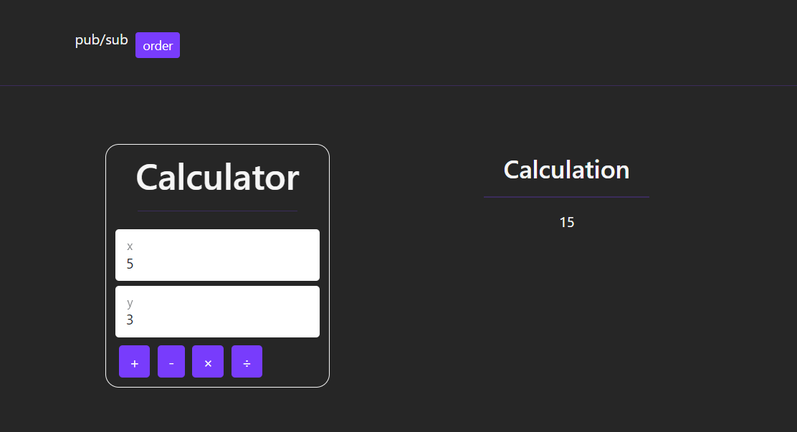
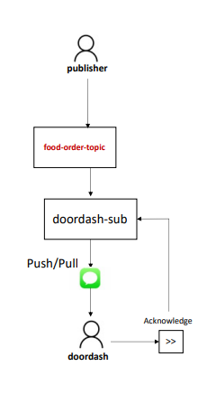

# Google Cloud Functions AND Pub/Sub Demonstration

* ## [Demo site here:](https://storage.googleapis.com/cs4843-q8/q8/index.html)

***What are Google Cloud Functions?***

    Google cloud functions are a quick and easy way to deploy microservices. They are a way of deploying small, light weight, individual api functions. It allows us to forgot about the sercer and just go straight to programming

## Task 1

Create and deploy a Cloud Function using Node.js and GCP CloudFunctions (***serverless***)

HTTP arguments:

* op: “add”, “sub”, ”mul”, ”div”, "pow"
* data1 (int)
* data2 (int)

## Task 2

create a pub-sub topic and a subscription to an order topic

